# Integrate GitLab with Conjur Enterprise using the JWT authenticator

## Introduction

- This guide demonstrates the integration between GitLab and Conjur using the JWT authenticator.
- The JWT authenticator relies on the trust between Conjur and GitLab via the JSON Web Key Set (JWKS).
- Each project on GitLab retrieving credentials will have its JWT signed and verified via the JWKS.
- This mitigates the "secret-zero" problem and enable each project on GitLab to be uniquely identified.
- The demonstration will run 2 projects:
  - MySQL Demo: Run a sql command to `SELECT` a random row from a database using the credentials retrieved from Conjur
  - AWS Access Key Demo: Run an AWS CLI command to test and show the caller STS token using the credentials retrieved from Conjur

## How does GitLab integration with Conjur using JWT work?

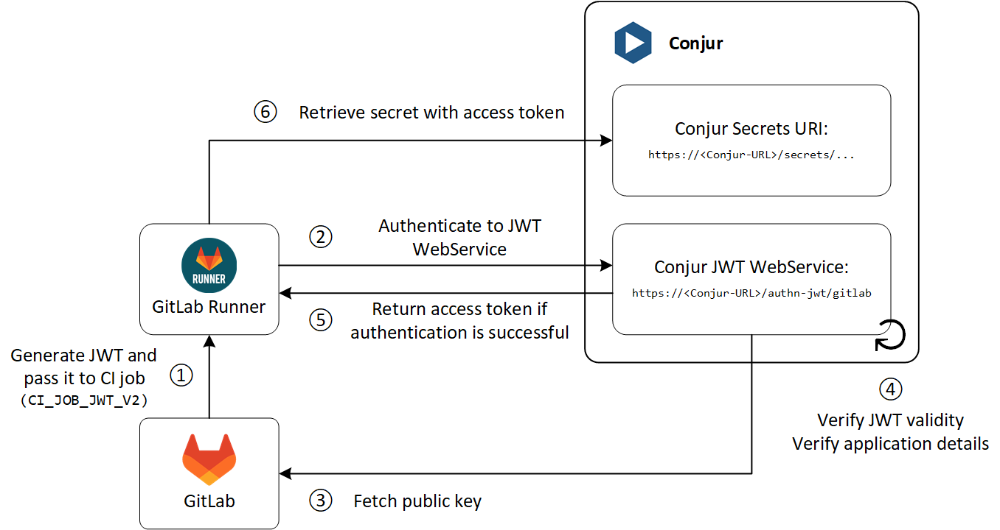

① Every GitLab CI/CD pipeline has a `CI_JOB_JWT_V2` JSON web token in the [predefined variables](https://docs.gitlab.com/ee/ci/variables/predefined_variables.html)

- Example JWT

```console
{
  "namespace_id": "2",
  "namespace_path": "cybr",
  "project_id": "2",
  "project_path": "cybr/aws-access-key-demo",
  "user_id": "1",
  "user_login": "root",
  "user_email": "joe.tan@cyberark.com",
  "pipeline_id": "2",
  "pipeline_source": "push",
  "job_id": "6",
  "ref": "main",
  "ref_type": "branch",
  "ref_protected": "true",
  "jti": "e8c142e7-fbc3-437f-a6c1-4aeccf6de6b4",
  "iss": "https://gitlab.vx",
  "iat": 1665704185,
  "nbf": 1665704180,
  "exp": 1665707785,
  "sub": "project_path:cybr/aws-access-key-demo:ref_type:branch:ref:main",
  "aud": "https://gitlab.vx"
}
```

② The GitLab runner sends an authentication request to Conjur using REST API to the JWT authenticator URI (`<Conjur-Appliance-URL>/authn-jwt/<service-id>`)

- The URI for this demo is `https://conjur.vx/authn-jwt/gitlab`

③ Conjur fetches the public key from the GitLab JWKS URI

- The GibLab JWKS URI is at `<GitLab-URL>/-/jwks/`
- This JWKS URI is set in the `jwks-uri` variable of the JWT authenticator in Conjur so that Conjur knows where to find the JWKS

④ Conjur verifies that the token is legit with the JWKS public key and authenticates application identity

- Conjur identifies the application identity via the `token-app-property` variable of the JWT authenticator
- The `token-app-property` variable is set in Conjur as the `project_path` claim in this demo
- Conjur further verifies the applications details as configured in the `annotations` listed in the `host` (application identity) declaration
- Annotation `sub` is defined for the application identity in this demo - the JWT claims from GitLab needs to tally with the declaration for application authentication to be successful
  - The `sub` claim from Gitlab is a combination of `project_path` + `ref_type` + `ref` attributes of the project (see example JWT above)

⑤ Conjur returns an access token to the GitLab runner if authentication is successful

⑥ The GitLab runner will then use the access token to retrieve the secrets using REST API to the secrets URI

### Software Versions

- RHEL 9.1
- Podman 4.2
- GitLab 15.9.3
- Conjur Enterprise 12.9.0

### Servers

| Hostname | Role |
| --- | --- |
| conjur.vx | Conjur master |
| gitlab.vx | Gitlab node + GitLab runner |
| mysql.vx | MySQL server |

# 1. Setup MySQL database

- Setup MySQL database according to this guide: <https://github.com/joetanx/mysql-install>

# 2. Setup Conjur master

- Setup Conjur master according to this guide: <https://github.com/joetanx/conjur-master>

# 3. Setup GitLab

## 3.1. Setup GitLab instance

### 3.1.1. Install GitLab instance

Ref: <https://computingforgeeks.com/how-to-install-and-configure-gitlab-on-centos-rhel/>

| Steps | Commands |
|---|---|
| Download repository script | `curl -O https://packages.gitlab.com/install/repositories/gitlab/gitlab-ce/script.rpm.sh` |
| Add execute permission to script | `chmod u+x script.rpm.sh` |
| Setup GitLab repository¹ | `os=el dist=8 ./script.rpm.sh` |
| Install GitLab | `yum -y install gitlab-ce` |
| Add firewall rules | `firewall-cmd --add-service=https --permanent && firewall-cmd --reload` |
| Clean-up | `rm -f script.rpm.sh /etc/yum.repos.d/gitlab_gitlab-ce.repo` |

¹ GitLab is not supported on RHEL 9 at point of writing, hence `os=el dist=8` is used here to set the OS and distribution to RHEL 8 for installation

### 3.1.2. Configure GitLab instance

Edit the GitLab configuration file at `/etc/gitlab/gitlab.rb`

#### External URL

```console
external_url 'https://gitlab.vx'
```

#### Initial root password

```console
gitlab_rails['initial_root_password'] = "Cyberark1"
```

#### Nginx SSL certificate

Ref: <https://computingforgeeks.com/how-to-secure-gitlab-server-with-ssl-certificate/>

```console
nginx['ssl_certificate'] = "/etc/gitlab/ssl/gitlab.vx.crt"
nginx['ssl_certificate_key'] = "/etc/gitlab/ssl/gitlab.vx.key"
```

#### Nginx listening port

```console
nginx['listen_port'] = 6443
```

#### Commit GitLab configuration

```console
gitlab-ctl reconfigure
```

### 3.1.2. (Optional) Edit group

- Change group name

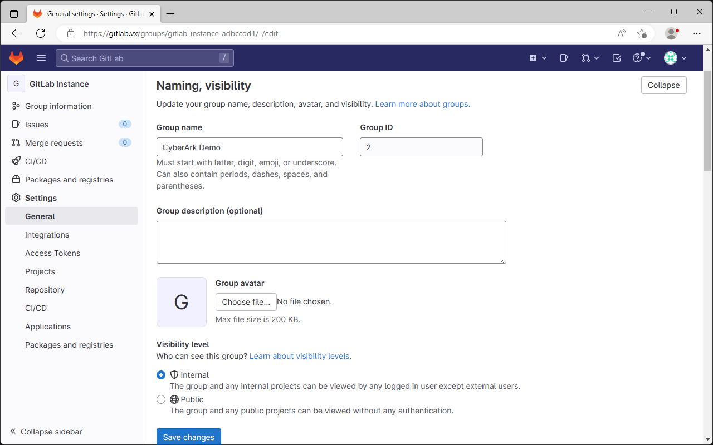

- Change group URL

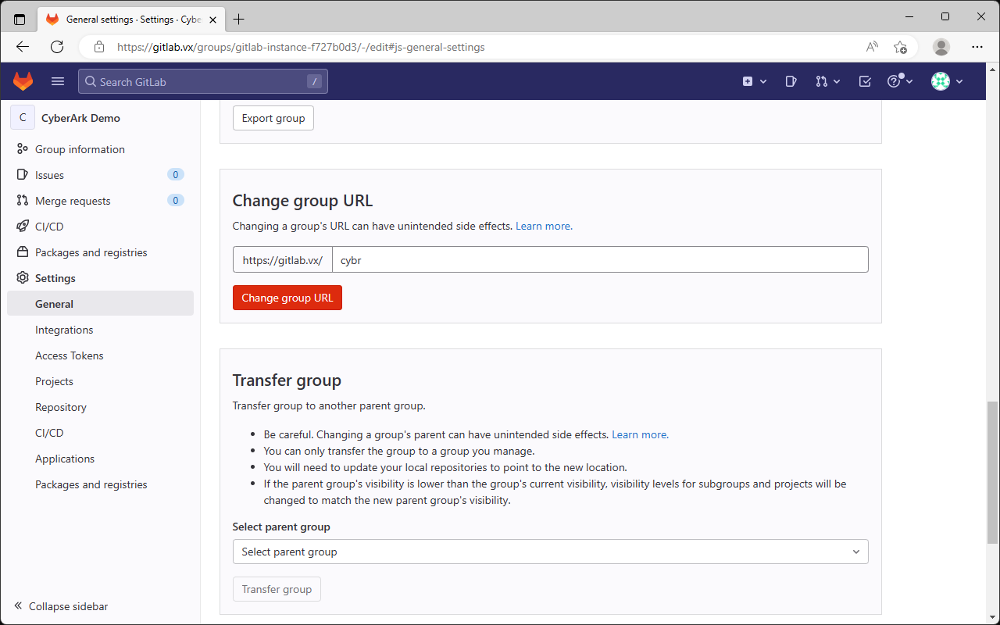

## 3.2. Setup GitLab runner

We'd be using Docker (Podman) executor for our GitLab runner

### 3.2.1. Prepare Podman environment

1. Install podman
2. Enable it to start on boot-up
3. Pull the following container images:
  - `docker.io/alpine/curl:latest`: used to call Conjur APIs, will be set as default image for GitLab runner
  - `docker.io/library/mysql:latest`: used for the MySQL connection demo
  - `docker.io/amazon/aws-cli:latest`: used for the AWS CLI demo
  - `docker.io/hashicorp/terraform:latest`: used for the Terraform demo
  - `registry.gitlab.com/gitlab-org/gitlab-runner/gitlab-runner-helper:latest`: GitLab runner required

```console
yum -y install podman
systemctl enable --now podman.socket
podman pull docker.io/alpine/curl:latest docker.io/library/mysql:latest docker.io/amazon/aws-cli:latest docker.io/hashicorp/terraform:latest registry.gitlab.com/gitlab-org/gitlab-runner/gitlab-runner-helper:latest
```

### 3.2.2. Install GitLab runner

| Steps | Commands |
|---|---|
| Download repository script | `curl -O https://packages.gitlab.com/install/repositories/runner/gitlab-runner/script.rpm.sh` |
| Add execute permission to script | `chmod u+x script.rpm.sh` |
| Setup GitLab repository¹ | `os=el dist=8 ./script.rpm.sh` |
| Install GitLab | `yum -y install gitlab-runner` |
| Allow `gitlab-runner` user to sudo without password prompt | `echo 'gitlab-runner ALL=(ALL) NOPASSWD: ALL' >> /etc/sudoers.d/gitlab-runner` |
| Clean-up | `rm -f  script.rpm.sh /etc/yum.repos.d/runner_gitlab-runner.repo` |

¹ GitLab is not supported on RHEL 9 at point of writing, hence `os=el dist=8` is used here to set the OS and distribution to RHEL 8 for installation

### 3.2.3. Prepare config template for GitLab runner registration

```console
cat  << EOF >> /tmp/test-config.template.toml
[[runners]]
[runners.docker]
host = "unix:///run/podman/podman.sock"
extra_hosts = ["conjur.vx:192.168.17.90","mysql.vx:192.168.17.90","gitlab.vx:192.168.17.91"]
EOF
```

Configurations used:
- `host = "unix:///run/podman/podman.sock"` is required to [use Podman to run Docker commands](https://docs.gitlab.com/runner/executors/docker.html#use-podman-to-run-docker-commands)
- `extra_hosts = ["conjur.vx:192.168.17.90","mysql.vx:192.168.17.90","gitlab.vx:192.168.17.91"]` to [add the host records](https://docs.gitlab.com/runner/configuration/advanced-configuration.html#the-runnersdocker-section) to `/etc/hosts` of the containers
  - (Detailed explanation on why I need this in my internal lab instead of adding DNS records:
    - Containers queries dual-stacked (`A` and `AAAA`) name resolution
    - My `.vx` domain results in a `NXDOMAIN for the `AAAA` (IPv6), since I only have `A` (IPv4) records of the hosts in my DNS

### 3.2.4. Register GitLab runner

GitLab runner can be added as a shared or project-specific runner

#### Generate registration token

- Shared runner

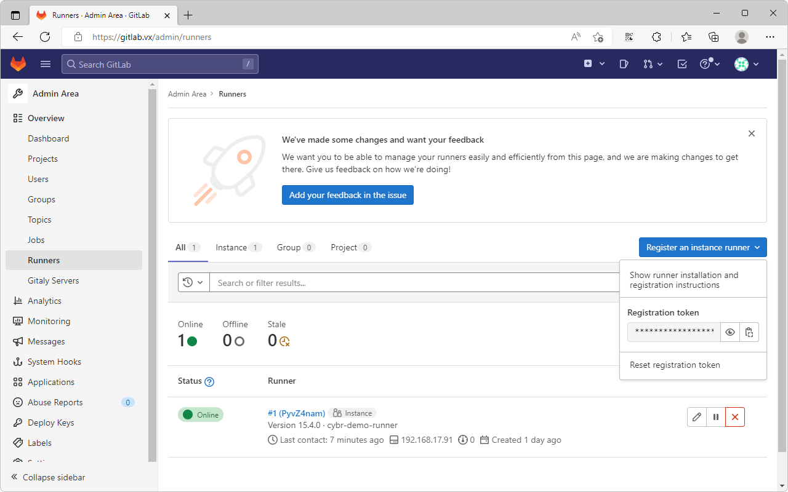

- Project-specific runner

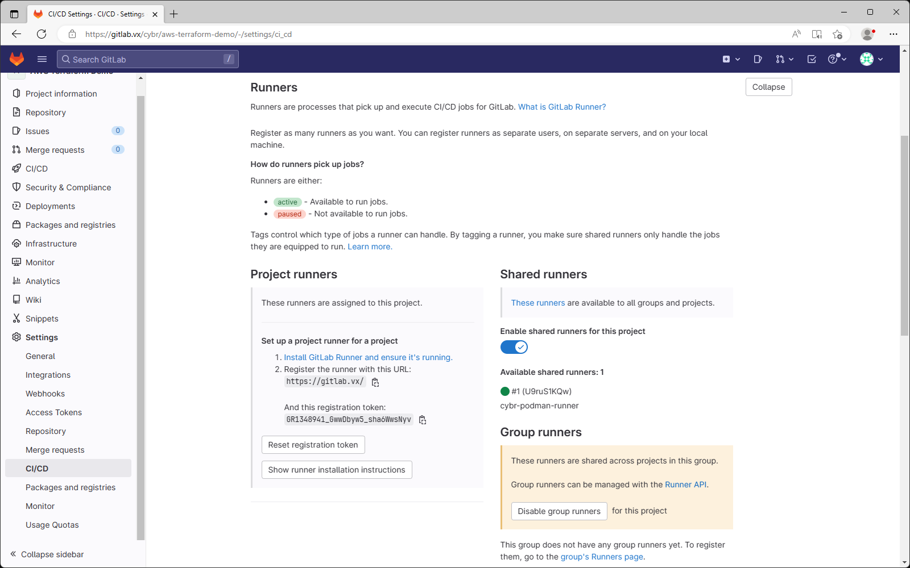

#### Register the runner

```console
gitlab-runner register \
--name cybr-podman-runner \
--url "https://gitlab.vx/" \
--registration-token <registration-token> \
--executor "docker" \
--template-config /tmp/test-config.template.toml \
--docker-image docker.io/alpine/curl:latest
```

# 4. Conjur policies for GitLab JWT

## 4.1. Details of Conjur policies used in this demo

### 4.1.1. authn-jwt.yaml

- Configures the JWT authenticator (<https://docs.cyberark.com/Product-Doc/OnlineHelp/AAM-DAP/Latest/en/Content/Operations/Services/cjr-authn-jwt.htm>)
- Defines the authenticator webservice at `authn-jwt/gitlab`
  - The format of the authenticator webservice is `authn-jwt/<service-id>`, the `<service-id>` used in this demo is `gitlab`, this is the URI where the GitLab pipeline will authenticate to.

- Defines the authentication variables: how the JWT Authenticator gets the signing keys

| Variables | Description |
|---|---|
| `jwks-uri` | JSON Web Key Set (JWKS) URI. For GitLab this is `https://<GitLab-URL>/-/jwks/`. |
| `public-keys` | Used to provide a static JWKS to the JWT authenticator if Conjur is unable to reach a remote JWKS URI endpoint |
| `ca-cert` | The CA certificate that signed the GitLab server certificate. **Implemented only beginning from Conjur version 12.5.** |
| `token-app-property` | The JWT claim to be used to identify the application. This demo uses the `project_path` claim from GitLab.  |
| `identity-path` | The Conjur policy path where the app ID (`host`) is defined in Conjur policy. The app IDs in `authn-jwt-hosts.yaml` are created under `jwt-apps/gitlab`, so the `identity-path` is `jwt-apps/gitlab`. |
| `issuer` | URI of the JWT issuer. This is the GitLab URL. This is included in `iss` claim in the JWT token claims. |
| `enforced-claims` | List of claims that are enforced (i.e. must be present in the JWT token claims). Not used in this demo. |
| `claim-aliases` | Map claims to aliases. Not used in this demo. |
| `audience` | This is also the GitLab URL. Not used in this demo (since this is idential to `issuer` for GitLab). |

- Defines `consumers` group - applications that are authorized to authenticate using this JWT authenticator are added to this group
- Defines `operators` group - users who are authorized to check the status of this JWT authenticator are added to this group

### 4.1.2. authn-jwt-hosts.yaml
- `jwt-apps/gitlab` - policy name, this is also the `identity-path` of the app IDs
- applications `cybr/aws-access-key-demo` and `cybr/mysql-demo` are configured
  - the `id` of the `host` corresponds to the `token-app-property`
  - annotations of the `host` are optional and corresponds to claims in the JWT token claims - the more specific the annotations/claims configured, the more precise and secure the application authentication
- the host layer is granted as a member of the `consumers` group defined in `authn-jwt.yaml` to authorize them to authenticate to the JWT authenticator
- `cybr/aws-access-key-demo` and `cybr/mysql-demo` are granted access to secrets in `aws_api` and `db_cicd` by granting them as members of the respective `consumers` group defined in `app-vars.yaml`
- ☝️ **Note**: `authn-jwt-hosts.yaml` builds on top of `app-vars.yaml` in <https://github.com/joetanx/conjur-master>. Loading `authn-jwt-hosts.yaml` without having `app-vars.yaml` loaded previously will not work.

## 4.2. Load the Conjur policies and prepare Conjur for GitLab JWT

- Login to Conjur

```console
conjur init -u https://conjur.vx
conjur login -i admin -p CyberArk123!
```

- Download and load the Conjur policies

```console
curl -O https://raw.githubusercontent.com/joetanx/conjur-gitlab/main/authn-jwt.yaml
curl -O https://raw.githubusercontent.com/joetanx/conjur-gitlab/main/authn-jwt-hosts.yaml
conjur policy load -b root -f authn-jwt.yaml && rm -f authn-jwt.yaml
conjur policy load -b root -f authn-jwt-hosts.yaml && rm -f authn-jwt-hosts.yaml
```

- Enable the JWT Authenticator

- ☝️ **Note**: This step requires that the `authenticators` section in `/etc/conjur/config/conjur.yml` to be configured (Ref: 2.5 <https://github.com/joetanx/conjur-master#25-allowlist-the-conjur-default-authenticator>)

```console
podman exec conjur sed -i -e '/authenticators:/a\  - authn-jwt/gitlab' /etc/conjur/config/conjur.yml
podman exec conjur evoke configuration apply
```

- Inject the CA certificate into a environment variable to be set into Conjur variable
- The GitLab server certificate in this demo is signed by a personal CA (`central.pem`), you should use your own certificate chain in your own environment
- ☝️ **Note**: The `authn-jwt/<service-id>/ca-cert` variable is implemented begining from Conjur version 12.5. If you are using an older version of Conjur, the CA certificates needs to be trusted by the Conjur container. Read the `Archived - Trusting CA certificate in Conjur container` section at the end of this page.

```console
CA_CERT="$(curl https://raw.githubusercontent.com/joetanx/conjur-gitlab/main/central.pem)"
```

- Populate the variables
- Assumes that the secret variables in `db_cicd` and `aws_api` are already populated in step 2 (Setup Conjur master)

```console
conjur variable set -i conjur/authn-jwt/gitlab/jwks-uri -v https://gitlab.vx/-/jwks/
conjur variable set -i conjur/authn-jwt/gitlab/ca-cert -v "$CA_CERT"
conjur variable set -i conjur/authn-jwt/gitlab/token-app-property -v project_path
conjur variable set -i conjur/authn-jwt/gitlab/identity-path -v jwt-apps/gitlab
conjur variable set -i conjur/authn-jwt/gitlab/issuer -v https://gitlab.vx
```

# 5. Configure GitLab

## 5.1. Configure MySQL Demo project

### Create a new project

☝️ Note: the `project namepace` + `project slug` forms the `project path`, this must match the `host identity` created in the Conjur policy


### Edit the GitLab CI/CD file

There are 2 jobs in the pipeline code below:
1. Fetch variables from Conjur (using `docker.io/alpine/curl:latest` image)
  - Authenticate to Conjur `authn-jwt/gitlab` using `CI_JOB_JWT_V2` for a session token
  - Retrive database credentials using the session token
  - Pass the credentials to the next job using `artifacts:`, `reports:`, `dotenv:`
2. Get a random row from database using variables from Conjur (using `docker.io/library/mysql:latest` image)
  - Login to the MySQL database to perform a `SELECT` command using the credentials from previous job

```yaml
Fetch variables from Conjur:
# Using default image docker.io/alpine/curl:latest configured in gitlab runner
  stage: .pre
  before_script:
    - 'SESSIONTOKEN=$(curl -k -X POST https://conjur.vx/authn-jwt/gitlab/cyberark/authenticate -H "Content-Type: application/x-www-form-urlencoded" -H "Accept-Encoding: base64" --data-urlencode "jwt=$CI_JOB_JWT_V2")'
    - 'MYSQLUSER=$(curl -k -H "Authorization: Token token=\"$SESSIONTOKEN\"" https://conjur.vx/secrets/cyberark/variable/db_cicd/username)'
    - 'MYSQLPASSWORD=$(curl -k -H "Authorization: Token token=\"$SESSIONTOKEN\"" https://conjur.vx/secrets/cyberark/variable/db_cicd/password)'
  script:
    - echo MYSQLUSER=$MYSQLUSER >> conjurVariables.env
    - echo MYSQLPASSWORD=$MYSQLPASSWORD >> conjurVariables.env
  artifacts:
    reports:
      dotenv: conjurVariables.env
Get a random row from database using variables from Conjur:
  image:
    name: docker.io/library/mysql:latest
    entrypoint: [""]
  script:
    - mysql --host=mysql.vx --user=$MYSQLUSER --password=$MYSQLPASSWORD -e 'SELECT city.Name as City,country.name as Country,city.District,city.Population FROM world.city,world.country WHERE city.CountryCode = country.Code ORDER BY RAND() LIMIT 0,1;'
```

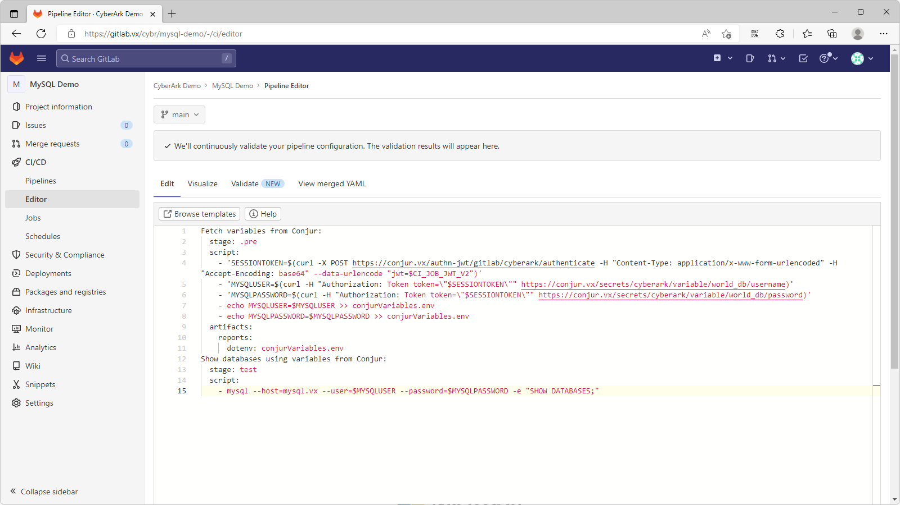

### Pipeline run results

Both jobs passed in the pipeline:

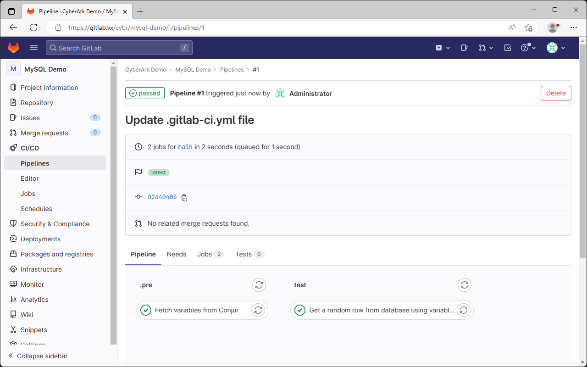

Output for fetch variables job:

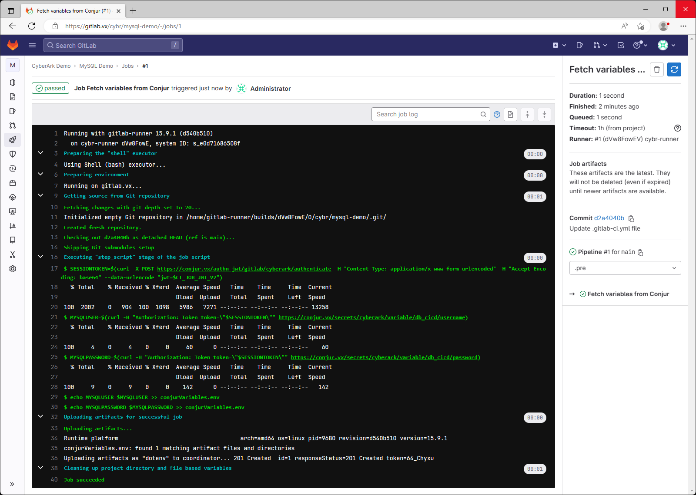

Output for show databases job:

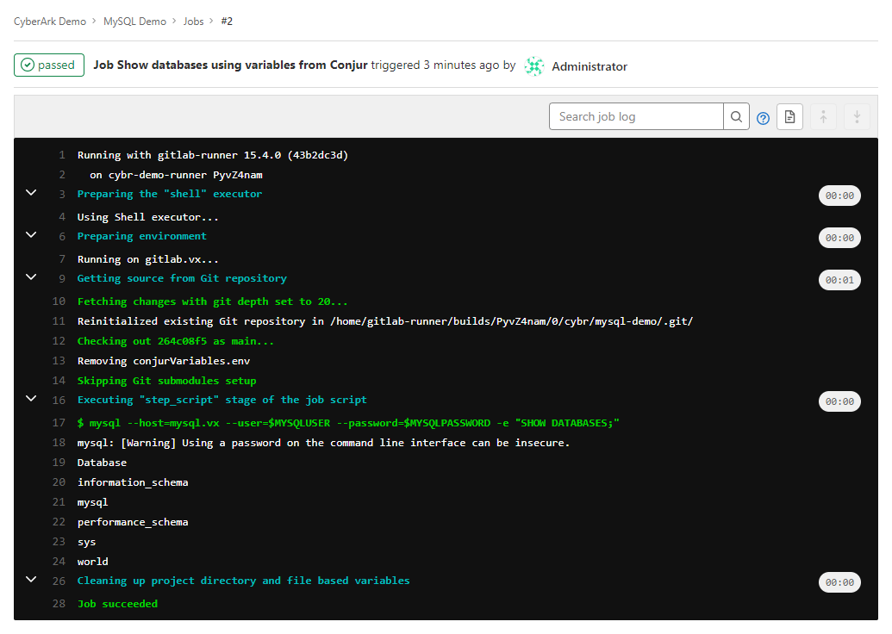

## 5.2. Configure AWS CLI Demo project

### Create a new project

☝️ Note: the `project namepace` + `project slug` forms the `project path`, this must match the `host identity` created in the Conjur policy

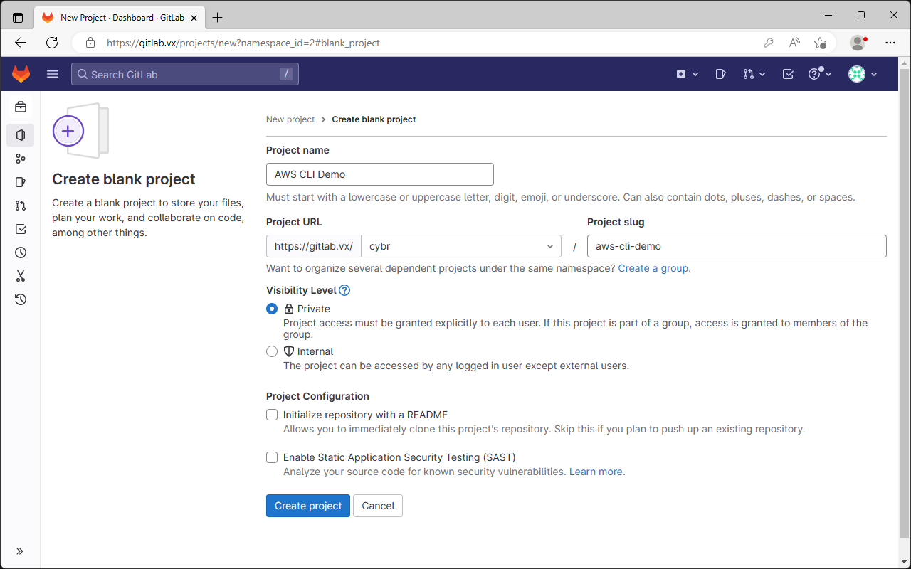

### Edit the GitLab CI/CD file

There are 2 jobs in the pipeline code below:
1. Fetch variables from Conjur (using `docker.io/alpine/curl:latest` image)
  - Authenticate to Conjur `authn-jwt/gitlab` using `CI_JOB_JWT_V2` for a session token
  - Retrive AWS credentials using the session token
  - Pass the credentials to the next job using `artifacts:`, `reports:`, `dotenv:`
2.Check caller AWS STS token via AWS CLI using variables from Conjur (using `docker.io/amazon/aws-cli:latest` image)
  - Run AWS CLI perform a `sts get-caller-identity` command using the credentials from previous job

```yaml
variables:
  AWS_REGION: ap-southeast-1
Fetch variables from Conjur:
# Using default image docker.io/alpine/curl:latest configured in gitlab runner
  stage: .pre
  before_script:
    - 'SESSIONTOKEN=$(curl -k -X POST https://conjur.vx/authn-jwt/gitlab/cyberark/authenticate -H "Content-Type: application/x-www-form-urlencoded" -H "Accept-Encoding: base64" --data-urlencode "jwt=$CI_JOB_JWT_V2")'
    - 'AWS_ACCESS_KEY_ID=$(curl -k -H "Authorization: Token token=\"$SESSIONTOKEN\"" https://conjur.vx/secrets/cyberark/variable/aws_api/awsakid)'
    - 'AWS_SECRET_ACCESS_KEY=$(curl -k -H "Authorization: Token token=\"$SESSIONTOKEN\"" https://conjur.vx/secrets/cyberark/variable/aws_api/awssak)'
  script:
    - echo AWS_ACCESS_KEY_ID=$AWS_ACCESS_KEY_ID >> conjurVariables.env
    - echo AWS_SECRET_ACCESS_KEY=$AWS_SECRET_ACCESS_KEY >> conjurVariables.env
  artifacts:
    reports:
      dotenv: conjurVariables.env
Check caller AWS STS token via AWS CLI using variables from Conjur:
  image:
    name: docker.io/amazon/aws-cli:latest
    entrypoint: [""]
  script:
    - aws sts get-caller-identity
```

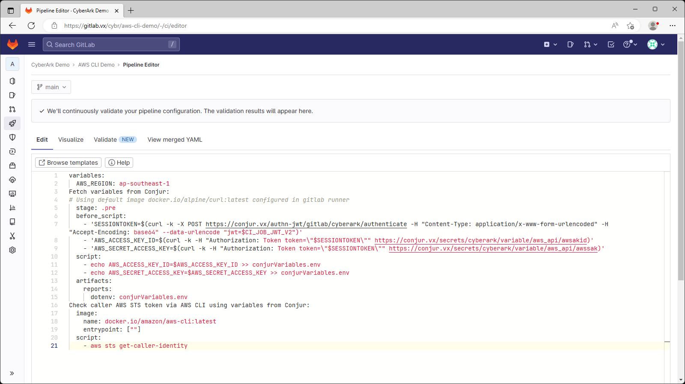

### Pipeline run results

Both jobs passed in the pipeline:

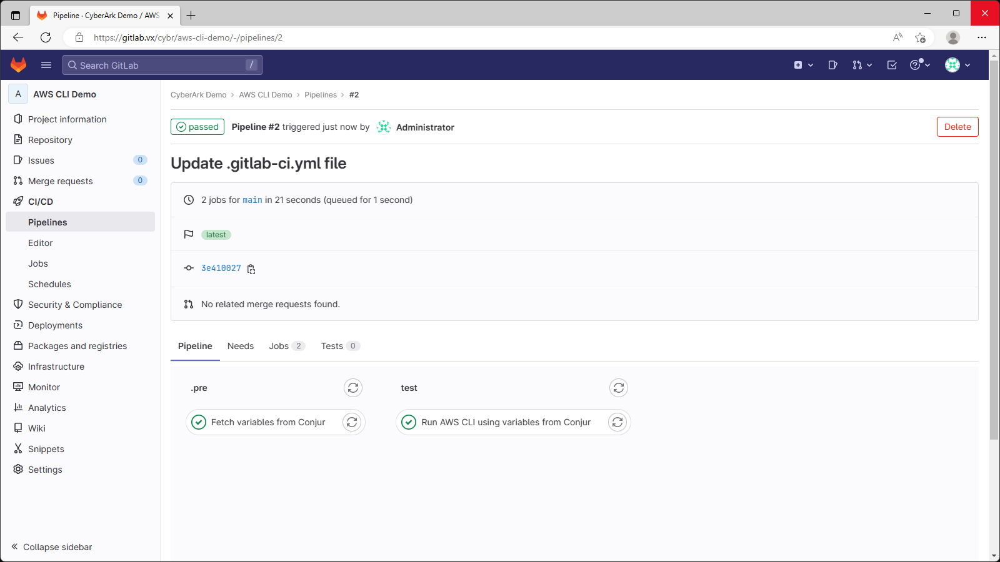

Output for fetch variables job:

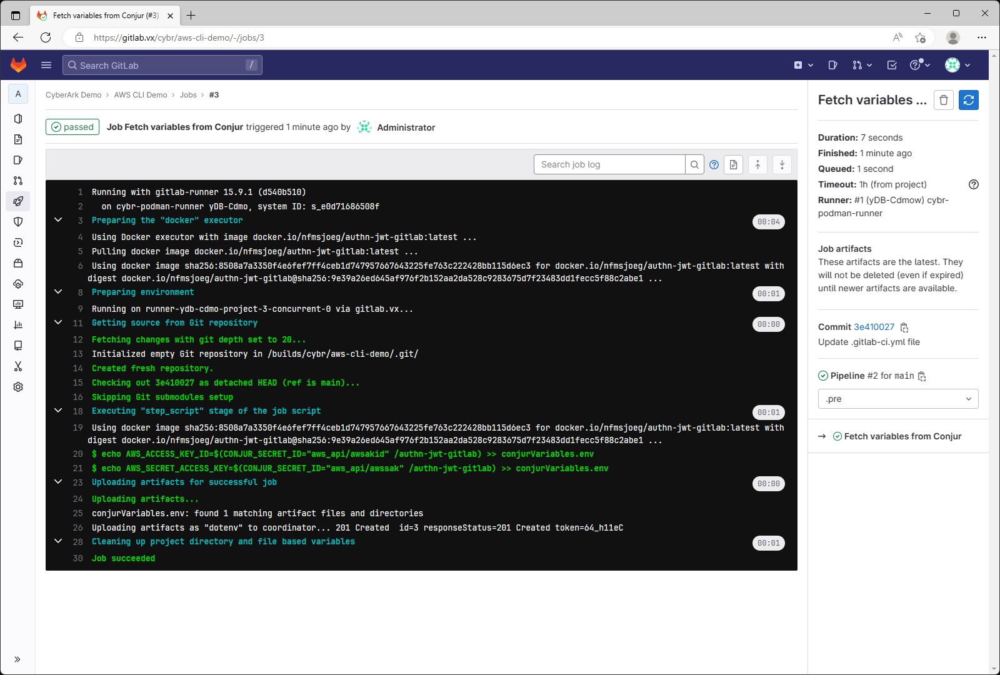

Output for list users job:

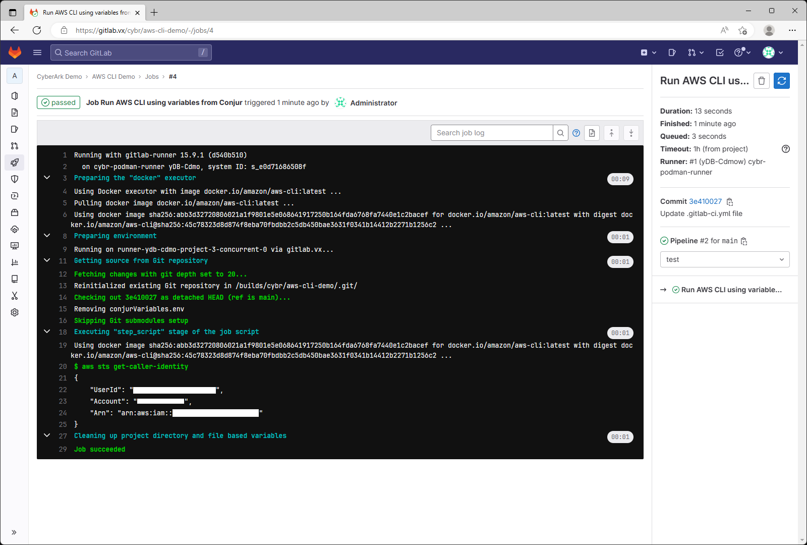

## 5.3. Configure AWS Terraform Demo project

### Create a new project

☝️ Note: the `project namepace` + `project slug` forms the `project path`, this must match the `host identity` created in the Conjur policy

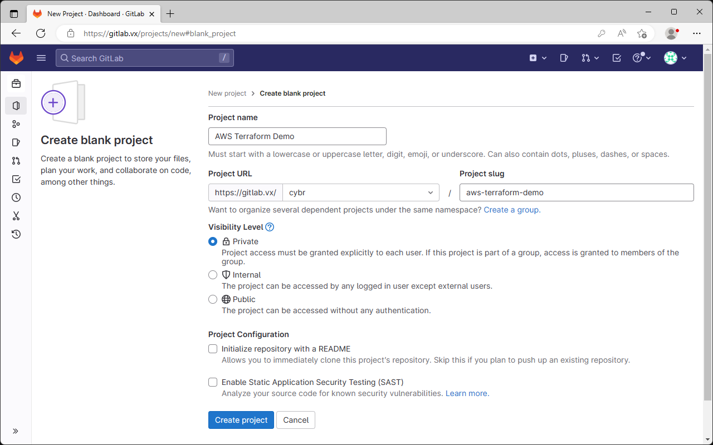

### Create the Terraform `main.tf` file:

```terraform
terraform {
  required_providers {
    aws = {
      source = "hashicorp/aws"
      version = "~> 4.0"
    }
  }
}

provider "aws" {} # Empty because using environment variables

data "aws_caller_identity" "current" {}

output "account_id" {
  value = data.aws_caller_identity.current.account_id
}

output "caller_arn" {
  value = data.aws_caller_identity.current.arn
}

output "caller_user" {
  value = data.aws_caller_identity.current.user_id
}
```

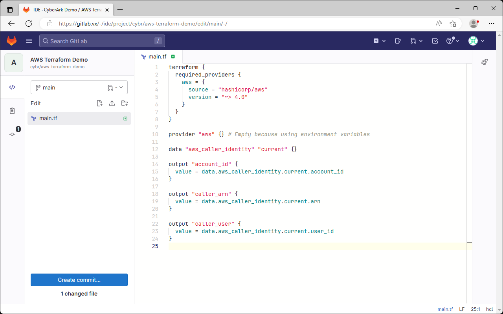

### Edit the GitLab CI/CD file

There are 2 jobs in the pipeline code below:
1. Fetch variables from Conjur (using `docker.io/alpine/curl:latest` image)
  - Authenticate to Conjur `authn-jwt/gitlab` using `CI_JOB_JWT_V2` for a session token
  - Retrive AWS credentials using the session token
  - Pass the credentials to the next job using `artifacts:`, `reports:`, `dotenv:`
2.Check caller AWS STS token via Terrform using variables from Conjur (using `docker.io/hashicorp/terraform:latest` image)
  - Run Terraform to execute the AWS actions in the `main.tf`
  - The AWS credentials is passed to the Terraform container from the previous job

```yaml
variables:
  AWS_REGION: ap-southeast-1
Fetch variables from Conjur:
# Using default image docker.io/alpine/curl:latest configured in gitlab runner
  stage: .pre
  before_script:
    - 'SESSIONTOKEN=$(curl -k -X POST https://conjur.vx/authn-jwt/gitlab/cyberark/authenticate -H "Content-Type: application/x-www-form-urlencoded" -H "Accept-Encoding: base64" --data-urlencode "jwt=$CI_JOB_JWT_V2")'
    - 'AWS_ACCESS_KEY_ID=$(curl -k -H "Authorization: Token token=\"$SESSIONTOKEN\"" https://conjur.vx/secrets/cyberark/variable/aws_api/awsakid)'
    - 'AWS_SECRET_ACCESS_KEY=$(curl -k -H "Authorization: Token token=\"$SESSIONTOKEN\"" https://conjur.vx/secrets/cyberark/variable/aws_api/awssak)'
  script:
    - echo AWS_ACCESS_KEY_ID=$AWS_ACCESS_KEY_ID >> conjurVariables.env
    - echo AWS_SECRET_ACCESS_KEY=$AWS_SECRET_ACCESS_KEY >> conjurVariables.env
  artifacts:
    reports:
      dotenv: conjurVariables.env
Check caller AWS STS token via Terraform using variables from Conjur:
  image:
    name: docker.io/hashicorp/terraform:latest
    entrypoint:
      - '/usr/bin/env'
      - 'PATH=/usr/local/sbin:/usr/local/bin:/usr/sbin:/usr/bin:/sbin:/bin'
  before_script:
    - rm -rf .terraform
    - terraform --version
    - terraform init
  script:
    - terraform plan
```

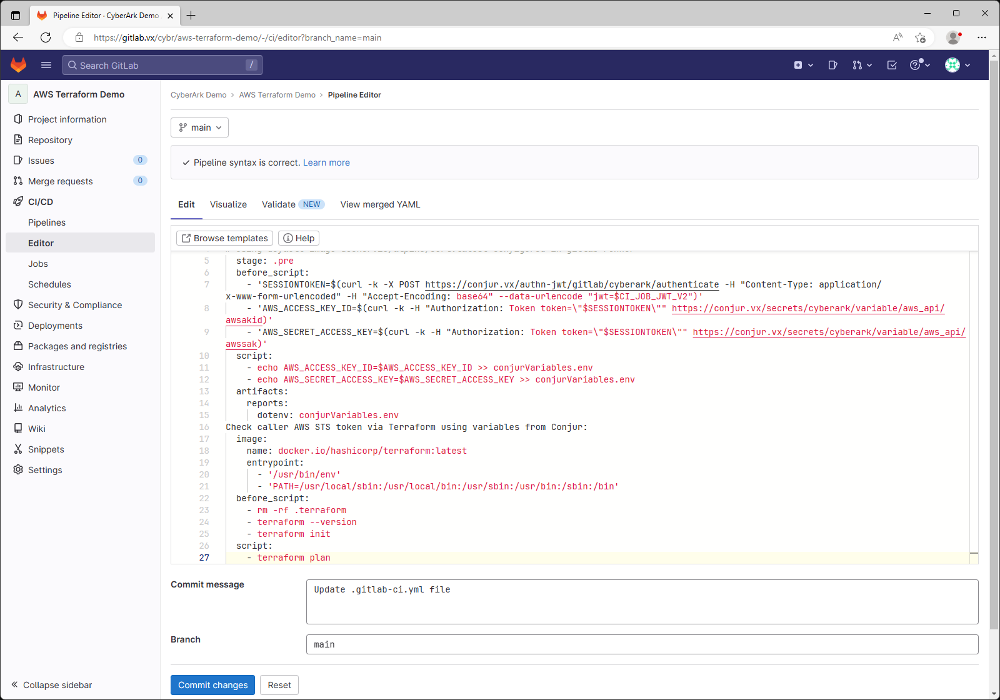

### Pipeline run results

Both jobs passed in the pipeline:

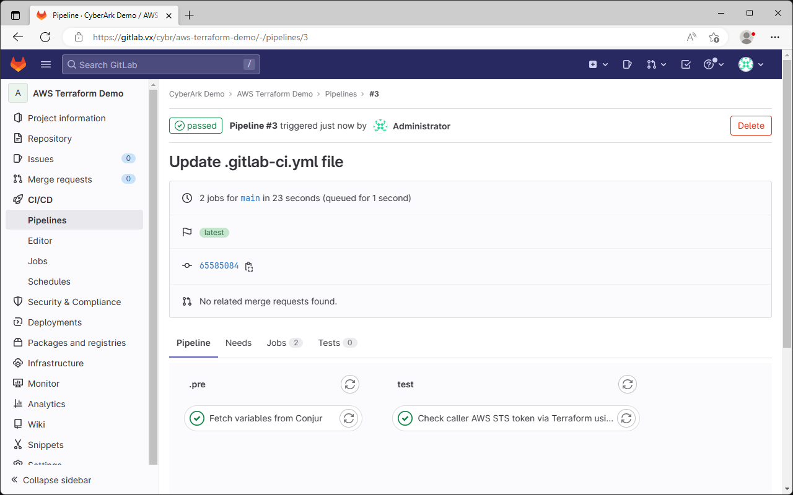

Output for fetch variables job:

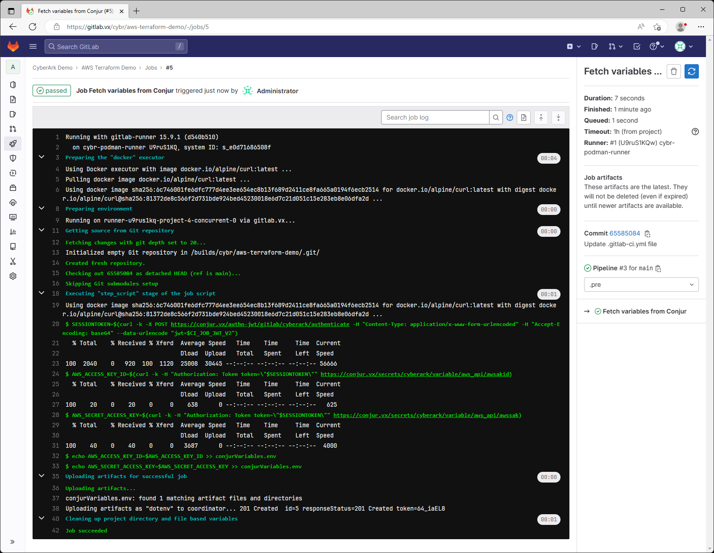

Output for list users job:

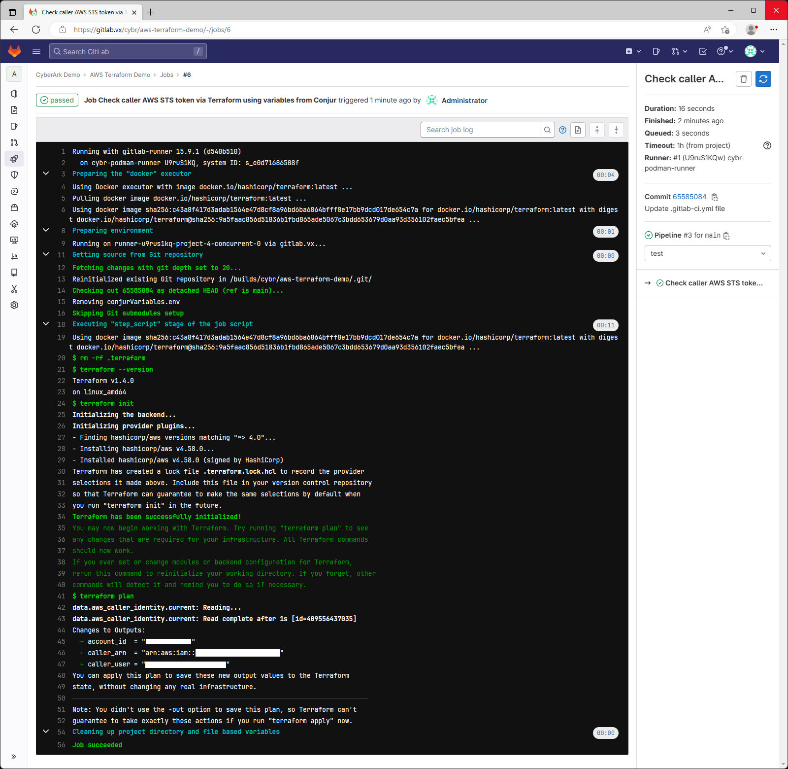

# Archived - Trusting CA certificate in Conjur container

- For Conjur versions before 12.5, the `authn-jwt/<service-id>/ca-cert` variable was not yet implemented.
- If you are using a self-signed or custom certificate chain in your GitLab like I did in this demo, you will encounter the following error in Conjur, because the GitLab certificate chain is not trusted by Conjur applicance.

```console
USERNAME_MISSING failed to authenticate with authenticator authn-jwt service cyberark:webservice:conjur/authn-jwt/gitlab:
**CONJ00087E** Failed to fetch JWKS from 'https://gitlab.vx-/jwks/'.
Reason: '#<OpenSSL::SSL::SSLError: SSL_connect returned=1 errno=0 state=error: certificate verify failed (self signed certificate in certificate chain)>'
```

- Import your GitLab certificate or the root CA certificate to Conjur appliance
- **Note**: The hash of my CA certificate is **a3280000**, hence I need to create a link **a3280000.0** to my CA certificate. You will need to get the hash of your own CA certificate from the openssl command, and link the certificate to `/etc/ssl/certs/<your-ca-hash>.0`
- This procedure is documented in: <https://cyberark-customers.force.com/s/article/Conjur-CONJ0087E-Failed-to-fetch-JWKS-from-GitLab-certificate-verify-failed>

```console
curl -O https://raw.githubusercontent.com/joetanx/conjur-gitlab/main/central.pem
podman cp central.pem conjur:/etc/ssl/certs/central.pem
podman exec conjur openssl x509 -noout -hash -in /etc/ssl/certs/central.pem
podman exec conjur ln -s /etc/ssl/certs/central.pem /etc/ssl/certs/a3280000.0
```
